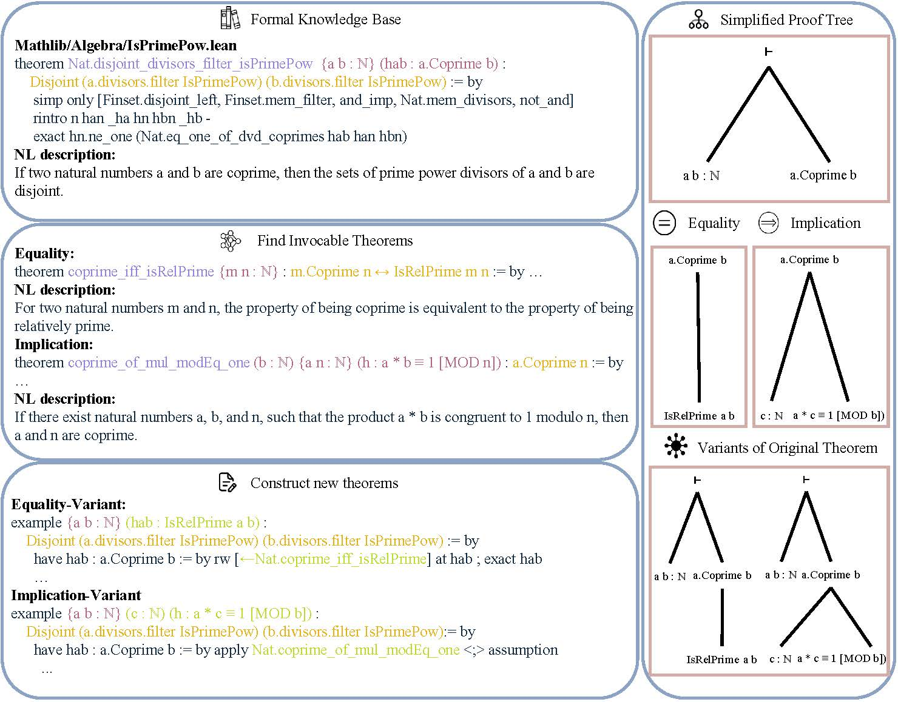

# Alchemy: Amplifying Theorem-Proving Capability through Symbolic Mutation


## Setup
### Prerequisites
- Python 3.10
### Environment Configuration
```bash
curl https://raw.githubusercontent.com/leanprover/elan/master/elan-init.sh -sSf | sh -s -- -y
pip install lean-dojo==1.7.1
pip install numpy tqdm
# Set the env variables 
export PATH=$$HOME/.elan/bin:$$PATH  
export GITHUB_ACCESS_TOKEN="Your Github Access Token"
elan toolchain install leanprover/lean4:v4.6.0-rc1
```
## Tutorial
We provide a tutorial (pipeline.ipynb) for how to mutate a demo theorem using theorems in Mathlib, which may be helpful for you to understanding our method. It includes the process to synthesize its variants, verify their correctness using Lean and trace the state-tactics.

## Alchemy
We provide several scripts for data-synthesis on mathlib.
### Find Invocable Theorems
```bash
# On each CPU node
# target_start;target_end : the start and end idx of target theorems on this node
# gen_mode : (rw|apply)
# timeout : hard timeout for each dojo env to reduce the time cost, usually 1h(3600s)
bash ./scripts/run_with_checkpoint.sh {target_start} {target_end} {gen_mode} {timeout}
```
### Mutate the Theorems
```bash
# You can take the implementation in mutate.py as reference.
python mutate.py
```
### Verify the Theorems
```bash
# On each CPU node, we verify a subset of modified Lean files.
# start, end : the start idx and end idx of modified lean files
# num_of_shard : how many shards are splitted between the start and end
# shard_id : the id for current node
python verify.py --data_path {synthesized_data_path} --output_path {output_path} --num_shard {num_of_shard} --shard_id {shard_id} --start {start} --end {end}
```
### Trace the Tactics
```bash
# You should write the variants into the mathlib repo and create a new github repo.
# Then you can use Leandojo to trace this repo.
# The traced cache is stored in traced_cache.
python extract_state_tactic.py --num_procs {num_procs} --repo_url {repo_url} --repo_commit {repo_commit} --traced_cache {path_of_traced_cache} --synthesized_corpus_path {path_of_synthesized_corpus}
```

### Citations
```
@article{DBLP:journals/corr/abs-2410-15748,
  author       = {Shaonan Wu and
                  Shuai Lu and
                  Yeyun Gong and
                  Nan Duan and
                  Ping Wei},
  title        = {Alchemy: Amplifying Theorem-Proving Capability through Symbolic Mutation},
  journal      = {CoRR},
  volume       = {abs/2410.15748},
  year         = {2024},
  url          = {https://doi.org/10.48550/arXiv.2410.15748},
  doi          = {10.48550/ARXIV.2410.15748},
  eprinttype    = {arXiv},
  eprint       = {2410.15748},
  timestamp    = {Tue, 26 Nov 2024 15:54:18 +0100},
  biburl       = {https://dblp.org/rec/journals/corr/abs-2410-15748.bib},
  bibsource    = {dblp computer science bibliography, https://dblp.org}
}
```